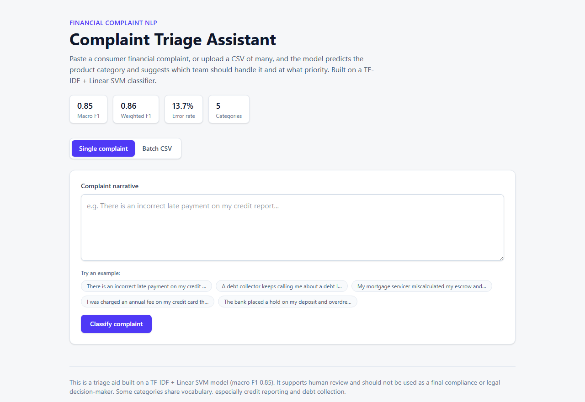
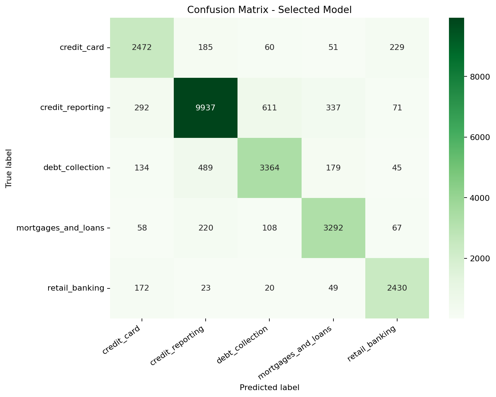

# Financial Complaint NLP Classifier

This project uses consumer financial complaint narratives to build an NLP
classifier that predicts the financial product category of each complaint and
supports complaint triage.

The current version is a classical NLP classification project. The workflow
starts with exploratory data analysis of the processed complaint dataset, then
compares Bag of Words and TF-IDF baselines before selecting a tuned Linear SVM
model.

> **Live demo:** https://complaint-triage.vercel.app — paste a complaint (or
> upload a CSV) and see the predicted product category and suggested triage
> routing. See [Live Demo (Web App)](#live-demo-web-app) for how it works.

## Business Value

Financial institutions receive large volumes of customer complaints across
products such as credit cards, banking, mortgages, credit reporting, and debt
collection. A classifier like this can help:

- Route complaints to the correct product or operations team
- Reduce manual triage effort
- Identify recurring product or servicing issues
- Support compliance monitoring and complaint trend analysis
- Prioritize error review for complaint categories that are often confused

## Live Demo (Web App)

A small web interface lets anyone try the classifier without running any code:

**→ https://complaint-triage.vercel.app**

[](https://complaint-triage.vercel.app)

- **Single complaint:** type or paste a narrative and get the predicted product
  category, a suggested team, a priority, and a short triage note.
- **Batch:** upload a CSV of complaints, see a summary by category, and download
  the triaged results.

How it works:

```text
browser (Next.js UI)
  -> parses the CSV in-browser, POSTs { "texts": [...] } to /api/predict
Python serverless function (api/predict.py)
  -> loads the saved scikit-learn model (complaint_classifier.joblib)
  -> returns predicted_product + suggested_team + priority + triage_note
```

- Single complaint and batch upload share the same endpoint (single = a
  one-element array).
- The model artifact is bundled into the serverless function, so inference runs
  on the same TF-IDF + Linear SVM classifier described below — no separate
  service or database.
- Hosted on Vercel with GitHub push-to-deploy: pushing to `main` redeploys the
  app automatically. The front-end lives in [`web/`](web/) (see
  [`web/README.md`](web/README.md) for architecture and local development).

Demo limitations to be aware of:

- The serverless function may have a short **cold-start delay** on the first
  request after it has been idle (the model is loaded on demand).
- Batch upload is capped at **2,000 complaints per request** to stay within the
  function's time and memory budget.
- It runs on Vercel's **free tier**, so it is intended for demonstration and
  evaluation, not production traffic.
- Predictions reflect the model's own limits (see [Limitations](#limitations)),
  e.g. overlap between `credit_reporting` and `debt_collection`.

## How to Read This Project

Start with the notebooks in this order:

1. [EDA notebook](notebooks/EDA.ipynb)
   - Understand the dataset, class imbalance, duplicate records, text length, and important terms.
2. [Modeling notebook](notebooks/Modeling.ipynb)
   - Compare baseline classifiers, tune the top 3 validation models, and evaluate the selected classifier.

The project flow is:

```text
raw complaint narratives
-> EDA and data quality checks
-> remove missing and duplicate text
-> compare Bag of Words and TF-IDF baselines
-> tune the top 3 validation models
-> evaluate the selected model
-> save the classifier locally
-> run prediction examples
-> confusion matrix and error review
```

## How to Run

Before running the notebooks or scripts, download `complaints_processed.csv`
as described in [Data Setup](#data-setup).

Install dependencies:

```bash
pip install -r requirements.txt
```

Train the selected classifier and save the model artifact:

```bash
python -m src.train
```

Run a prediction from the command line:

```bash
python -m src.predict "There is an incorrect late payment on my credit report."
```

Example output:

```text
Predicted product: credit_reporting
Suggested team: Credit Reporting Disputes Team
Priority: Compliance review
```

## Future GenAI Work

This repository is currently an NLP classifier, not a GenAI assistant. A future
GenAI extension could use the predicted product category to:

- Route the complaint to a product-specific knowledge base
- Retrieve relevant policy or compliance context
- Draft a first-pass complaint summary
- Suggest the correct operations or compliance team
- Support human review rather than replacing it

This future layer would be built on top of the classifier, not instead of it. It
is listed as future work only.

## Project Status

Completed:

- Data setup instructions
- Exploratory data analysis notebook
- Class distribution review
- Text length analysis
- TF-IDF term analysis
- Word clouds by product category
- Modeling recommendations
- Bag of Words and TF-IDF baseline comparison
- Top 3 model tuning using validation macro F1
- Final selected complaint classification model
- Saved model generation and prediction examples

Possible future improvement:

- Add deeper error analysis for the most confused product-category pairs.

## Repository Structure

```text
financial-complaint-nlp-classifier/
+-- notebooks/
|   +-- EDA.ipynb
|   +-- Modeling.ipynb
+-- models/
|   +-- README.md
+-- reports/
|   +-- README.md
|   +-- figures/
|       +-- confusion_matrix.png
+-- src/
|   +-- __init__.py
|   +-- predict.py
|   +-- train.py
+-- web/                     # deployed front-end (Next.js UI + Python API)
|   +-- app/                 # UI (single complaint + batch CSV)
|   +-- api/predict.py       # serverless inference function
|   +-- README.md
+-- README.md
+-- requirements.txt
+-- LICENSE
+-- .gitignore
```

## Data Setup

This project uses a Kaggle dataset. Data files are not included in the
repository.

Download the dataset from Kaggle and place the file in the project root:

- Dataset: [Consumer Complaints Dataset for NLP](https://www.kaggle.com/datasets/shashwatwork/consume-complaints-dataset-fo-nlp)
- File used: `complaints_processed.csv`

Expected local layout:

```text
financial-complaint-nlp-classifier/
+-- complaints_processed.csv
+-- notebooks/
    +-- EDA.ipynb
```

The notebooks read the data with:

```python
data_path = '../complaints_processed.csv'
```

So run the notebooks from inside the `notebooks/` folder or open them normally
in Jupyter from the project directory.

Data files are listed in `.gitignore` and should not be committed.

## Notebook

- [EDA notebook](notebooks/EDA.ipynb)
- [Modeling notebook](notebooks/Modeling.ipynb)

The EDA notebook includes:

- Dataset shape and missing value checks
- Duplicate and short-text checks
- Product category distribution
- Class imbalance calculation
- Complaint length analysis
- High-signal TF-IDF terms and bigrams
- Category overlap review
- Word clouds for each product category
- Modeling recommendations

## EDA Highlights

- The full dataset contains 162,421 complaints across 5 product categories.
- `credit_reporting` is the largest class, creating a clear class imbalance.
- Missing complaint narratives are minimal.
- Bigrams are more useful than single words for separating product categories.
- Banking-related categories share vocabulary and may need closer error
  analysis during modeling.

## Modeling Summary

The modeling notebook includes:

- Cleaning missing or empty complaint narratives
- Removing exact duplicate narratives before splitting
- Stratified train/test split
- Bag of Words and TF-IDF text features
- Comparison of Dummy, Naive Bayes, SGD, Logistic Regression, and Linear SVM models
- Top 3 model selection before tuning
- Model selection using validation macro F1
- Macro F1, weighted F1, and per-class recall
- Saved model generation with `joblib`
- Example predictions on new complaint text
- Confusion matrix and error analysis

## Confusion Matrix

The selected model still shows meaningful overlap between some product
categories, especially `credit_reporting` and `debt_collection`.



Selected model:

- Model: `TFIDF_LinearSVC_ngram(1, 3)_min3_C0.5`
- Macro F1: 0.85
- Weighted F1: 0.86
- Error rate: 13.66%

The selected model is a TF-IDF + Linear SVM classifier using unigrams, bigrams,
and trigrams. It was selected because it had the best validation macro F1 among
the tested baseline models.

How to interpret this:

- Macro F1 gives each class equal weight, so it is important for this imbalanced
  dataset.
- Weighted F1 accounts for class size and is useful for overall model
  performance.
- The small gap between macro F1 and weighted F1 suggests that performance is
  fairly balanced across classes despite the class imbalance.
- The confusion matrix is still needed to find specific category overlaps,
  especially between `credit_reporting` and `debt_collection`.

After removing exact duplicate narratives, the baseline is a more honest
estimate of model performance because the same complaint text is less likely to
appear in both training and test data.

## Model Artifact

The modeling notebook and `src.train` save the selected classifier locally:

```text
models/complaint_classifier.joblib
```

The artifact is ignored by Git because it can be regenerated from the notebook
and may become large.

## Limitations

- The model is trained on processed complaint narratives, not raw complaint
  intake text.
- The project does not connect to live CFPB or banking systems.
- The classifier supports triage, but it should not be used as a final
  compliance or legal decision-maker.
- Some categories share vocabulary, especially `credit_reporting` and
  `debt_collection`, which creates unavoidable classification ambiguity.
- The GenAI assistant layer is future work and is not part of the current
  implementation.

## Requirements

Main Python packages used:

```text
pandas
numpy
matplotlib
seaborn
scikit-learn
wordcloud
jupyter
joblib
```

Install them with:

```bash
pip install -r requirements.txt
```
